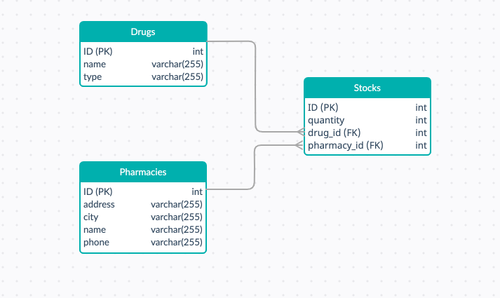

# Elysian-be
Backend for Elysian interview project.

## Start app

I used postgres for database, but docker will take care to download the image for you.

The image for spring project is tagged in docker-compose, so you have to run this command first, from project root:

### `docker build ./ -t springbootapp`

Now everything is setup, you just have to run :

### `docker-compose up`

Now database and project should be running. (Note that database will be initialized by docker and filled with some data, i used a volume for that).

If something goes wrong with docker-compose, you can just can run the next docker commands, and then simply run the project from your IDE.

### `docker create -v /var/lib/postgresql/data --name PostgresData alpine`

### `docker run -p 5432:5432 --name postgres -e POSTGRES_PASSWORD=admin -d --volumes-from PostgresData postgres`

(Nota that in this way you will have no intial data in the tables, you can find the inserts queries in init.sql file)

Maybe you will also need to clean-up your previous builds before running docker-compose :

### `./mvnw clean package -DskipTests`


## Database schema



##Routes

The main routes, used in frontend are:


### `http://localhost:8080/stocks/${city_name}/$drug_name}`
(**_Get given drug quantity from given town_**)

Response example: 150


### `http://loclahost:8008/stocks/${drug_name}`
(**_Get for given drug all pharmacies where it can be find_**)

Response example (JSON) :
----

```json
[
    {
        "id": 4,
        "name": "Farmavet",
        "address": "Gheorghe Doja",
        "city": "Timisoara",
        "phone": "0254251261"
    },
    {
        "id": 7,
        "name": "InfoFarm",
        "address": "Strada Garii",
        "city": "Cluj",
        "phone": "0254241505"
    }
]
```


### `http://localhost:8080/pharmacies/city/${city_name}`
(**_Get all pharmacies from a given city_**)

Response example (JSON) :
----

```json
[
    {
        "id": 7,
        "name": "InfoFarm",
        "address": "Strada Garii",
        "city": "Cluj",
        "phone": "0254241505"
    },
    {
        "id": 8,
        "name": "GeroFarm",
        "address": "Strada Garii",
        "city": "Cluj",
        "phone": "0372409406"
    }
]
```

### How stocks are looking as a response:

```json
[
    {
        "id": 1,
        "pharmacies": {
            "id": 1,
            "name": "Catena",
            "address": "Strada Garii",
            "city": "Bucuresti",
            "phone": "0767778891"
        },
        "drugs": {
            "id": 1,
            "name": "Olaflur",
            "type": "COMPRIMATE"
        },
        "quantity": 100
    },
    {
        "id": 2,
        "pharmacies": {
            "id": 1,
            "name": "Catena",
            "address": "Strada Garii",
            "city": "Bucuresti",
            "phone": "0767778891"
        },
        "drugs": {
            "id": 2,
            "name": "Clorhexidina",
            "type": "COMPRIMATE"
        },
        "quantity": 50
    }
]
```


